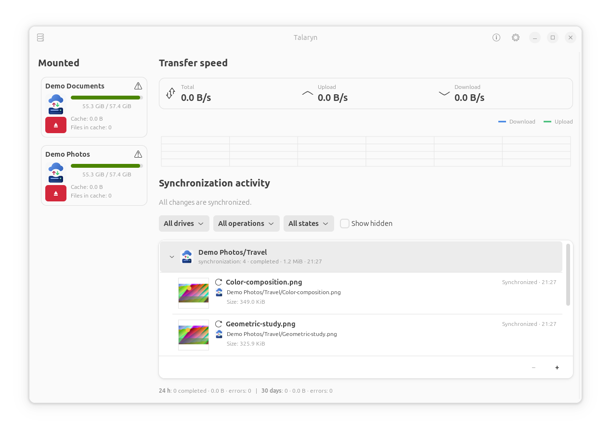
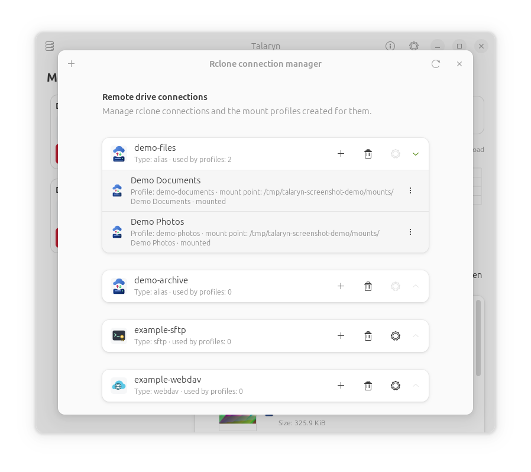
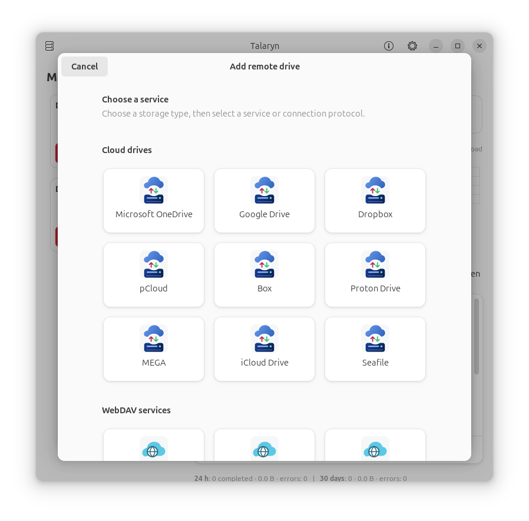
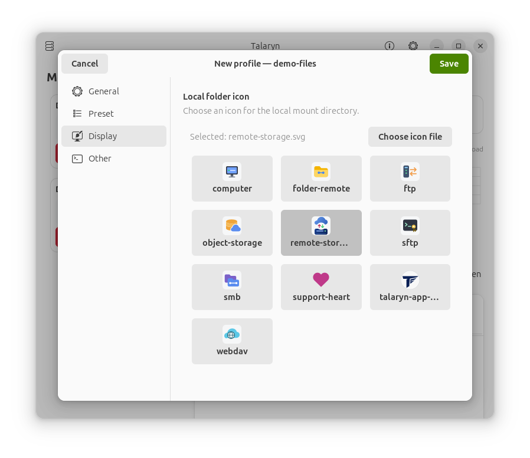

# Talaryn

<p align="center">
  
</p>

<p align="center">
  <a href="https://github.com/k-krakowski/talaryn/actions/workflows/ci.yml"></a>
  <a href="https://github.com/k-krakowski/talaryn/releases/latest"></a>
  <a href="./LICENSE"></a>
  <a href="#requirements"></a>
  <a href="#help-translate-talaryn"></a>
</p>

*"Give your cloud wings"*

Talaryn is a graphical Linux interface for mounting cloud and remote storage as
local drives using rclone.

The built-in connection wizard can configure OneDrive, Google Drive, Dropbox,
pCloud, Box, WebDAV, SMB/CIFS, Backblaze B2, S3-compatible storage, SFTP, and
FTP/FTPS remotes. Remotes created earlier with `rclone config` remain supported.

## Install

The Debian package is the recommended installation method on Ubuntu 24.04.

1. Download `talaryn_1.0.0_all.deb` from the
   [latest release](https://github.com/k-krakowski/talaryn/releases/latest).
2. In the directory containing the downloaded package, run:

   ```bash
   sudo apt install ./talaryn_1.0.0_all.deb
   ```

   APT installs the declared dependencies from your configured repositories.
   Talaryn requires rclone 1.74.4 or newer; if your repositories do not provide
   it, install an [official rclone package](https://rclone.org/install/) first.
3. Restart Nautilus and launch Talaryn:

   ```bash
   nautilus -q
   talaryn gui
   ```

See [Requirements](#requirements) for supported library versions and other
installation details.

## Screenshots

<table>
  <tr>
    <td align="center" colspan="3">
      <a href="./docs/screenshots/main-window.png">
        
      </a><br>
      <sub><b>Main window</b><br>Mount profiles and synchronization activity</sub>
    </td>
  </tr>
  <tr>
    <td align="center" valign="top" width="33.33%">
      <a href="./docs/screenshots/connection-manager.png">
        
      </a><br>
      <sub><b>Connection manager</b><br>Configured cloud and remote storage</sub>
    </td>
    <td align="center" valign="top" width="33.33%">
      <a href="./docs/screenshots/connection-wizard.png">
        
      </a><br>
      <sub><b>Connection wizard</b><br>Cloud services and connection protocols</sub>
    </td>
    <td align="center" valign="top" width="33.33%">
      <a href="./docs/screenshots/profile-editor.png">
        
      </a><br>
      <sub><b>Profile editor</b><br>Mount paths, cache presets, and profile options</sub>
    </td>
  </tr>
</table>

Click a screenshot to open it at full size.

## Features

- GTK 4 / libadwaita interface for managing mount profiles.
- Guided rclone connection wizard and connection manager for consumer cloud
  drives, WebDAV/SMB servers, B2 and S3 object storage, SFTP, and FTP/FTPS,
  including editing, browser OAuth reauthorization, deletion safeguards,
  connection testing, and secure defaults.
- User systemd services for reliable foreground `rclone mount` processes.
- Panel/AppIndicator menu for quick mount, unmount, open, and log actions.
- Separate profiles for different paths inside the same rclone remote.
- Documented profile presets for balanced use, large files, large trees of
  small files, low local cache, and editor-oriented SFTP. A separate SFTP
  preset disables remote checksum commands for external SSH and servers with
  strict connection limits.
- Remote directory picker for choosing the rclone path.
- Per-profile folder icons for the local mount directories.
- Profile properties view with mount status, disk usage, mount command, and logs.
- One filtered, scrollable synchronization timeline with cached thumbnails,
  expandable folder/time groups, one compact path starting at the mount folder
  per change,
  synchronization/modify/rename/delete details, upload progress, queue
  priority, retries, errors, ETA, and persistent SQLite history.
- A shared background monitor uses the rclone 1.74.4 RC API (`vfs/queue`,
  `vfs/stats`, `core/stats`, and `core/transferred`) for GUI, tray, and Nautilus.
- Live combined, upload, and download speed metrics with a five-minute graph and
  daily totals. Optional upload and download limits can be changed immediately.
- VFS cache health, remote quota information, error notifications, and a safe
  "wait for synchronization and unmount" action.
- Per-mount synchronization indicators and an explicit warning before
  unmounting a drive that still has active or queued transfers.
- Optional auto-remount and "mount again after login" behavior.
- Nautilus extensions:
  - Synchronized and synchronizing emblems for files in rclone mounts (Google
    Docs/Sheets/Slides link files keep only their document-type emblems).
  - Neutral, project-authored document, spreadsheet, and presentation emblems
    for exported Google Docs/Sheets/Slides `.link.html` files.
  - An "Export Google document…" action for Google `.link.html` entries. It
    explains that ordinary copy/move operations handle only the browser link,
    then exports the real document in a chosen format to a chosen location.
  - A recovery notification after a Google document link is deleted or moved
    outside its mount, reminding the user that the original can be restored
    from Google Drive Trash.
  - "New Google" document creation inside Google Drive mounts, with one branded
    window for naming and progress, followed by a targeted directory refresh
    and a persistent creation entry in activity history.
    On X11 the window opens near the pointer; on Wayland it is attached to the
    originating Nautilus window when a parent handle is available.
  - SFTP context actions: open matching remote path in an external terminal and
    copy the corresponding rclone remote path.
- English, Polish, and Russian translations.

The file and folder comparison tool is in **beta** and is disabled by default.
Enable it in **Settings → Experimental features → File and folder comparison
(beta)** to use it from the panel menu, Nautilus, or `talaryn compare`.
An explicitly saved preference is preserved when upgrading.

## Requirements

Rclone **1.74.4 or newer** is required. The rclone package in older Ubuntu
repositories may not satisfy this requirement; use an official rclone package
from <https://rclone.org/install/> when necessary.

The primary supported development and packaging environment is **Ubuntu
24.04**. The application requires Python 3.10 or newer, GTK 4.10 or newer, and
libadwaita 1.5 or newer. Other distributions can work when they provide these
API versions, Nautilus 4 integration, FUSE 3, and systemd user services.

Ubuntu 24.04 package names:

```bash
sudo apt update
sudo apt install \
  python3 \
  python3-gi \
  python3-gi-cairo \
  gir1.2-gtk-4.0 \
  gir1.2-adw-1 \
  gir1.2-gnomedesktop-4.0 \
  gir1.2-gtk-3.0 \
  gir1.2-ayatanaappindicator3-0.1 \
  python3-nautilus \
  fuse3 \
  xdg-utils \
  libglib2.0-bin \
  libnotify-bin \
  zenity \
  systemd
```

Optional but useful:

```bash
sudo apt install wl-clipboard xclip xsel
```

You may also need the GNOME Shell AppIndicator/KStatusNotifier extension enabled
for the panel icon to appear.

The application translates its own interface through the JSON catalogues in
`i18n/`. Stock GTK/libadwaita labels use the selected system locale and may also
require the matching GNOME language pack to be installed.


`install.sh` checks prerequisites but does not install system packages. Installing
with `sudo apt install ./talaryn_1.0.0_all.deb` resolves the declared dependencies
from your configured repositories. If those repositories do not provide rclone
1.74.4 or newer, install an official rclone package first. `dpkg -i` alone does
not download dependencies.

## Install From Source

1. Clone <https://github.com/k-krakowski/talaryn> or download and unpack a source archive.
   Install the requirements listed above, then enter the resulting
   `talaryn` directory and install the app for the current user:

   ```bash
   ./install.sh
   ```

2. Restart Nautilus to load the extensions:

   ```bash
   nautilus -q
   ```

3. Run the GUI:

   ```bash
   talaryn gui
   ```

You can also launch it from the desktop application menu as **Talaryn**.
Open the rclone connection manager to add a remote, then use the `+` action next
to that connection to create a mount profile. The S3 form includes every
provider supported by rclone 1.74.4 plus a custom endpoint option. You can still
run `rclone config` manually for other backend types or advanced
configurations.

## Uninstall

Before uninstalling, wait for active and queued transfers to finish and
unmount every profile. Removing the launcher or systemd unit while a cached
write is pending can make safe recovery harder.

```bash
./uninstall.sh
```

For a Debian package, first unmount every profile in the application and then
run `sudo apt remove talaryn`. The package removal script refuses to
continue while it can identify an active mount created by the application.

User profiles remain in:

```text
~/.config/talaryn/
```

Remove that directory manually if you also want to delete saved profiles,
settings, and state.

## CLI

```bash
talaryn gui
talaryn tray
talaryn list
talaryn status PROFILE
talaryn mount PROFILE
talaryn unmount PROFILE
talaryn open PROFILE
talaryn forget PROFILE
```

`unmount` checks rclone directly and refuses to stop when transfers are pending
or their status cannot be verified. `talaryn unmount PROFILE --force` explicitly
bypasses this safeguard and may interrupt pending writes. `forget` requires the
profile to be unmounted and its service to be stopped. Close files on the drive
before unmounting; another application can start a new write after a status check.

Internal service commands:

```bash
talaryn mount-foreground PROFILE
talaryn unmount-raw PROFILE
talaryn monitor
```

## Files And Runtime Data

Source install locations:

```text
~/.local/bin/talaryn
~/.local/share/talaryn/
~/.local/share/applications/io.github.k_krakowski.Talaryn.desktop
~/.config/systemd/user/talaryn@.service
~/.local/share/nautilus-python/extensions/
```

User data:

```text
~/.config/talaryn/profiles.json
~/.config/talaryn/settings.json
~/.config/talaryn/state.json
~/.cache/talaryn/
~/.cache/thumbnails/
~/cloud/
```

Synchronization monitoring additionally uses:

```text
~/.cache/talaryn/activity.db
~/.cache/talaryn/sync-status.json
~/.cache/talaryn/nautilus-status.json
$XDG_RUNTIME_DIR/talaryn/PROFILE.sock
```

The activity list intentionally includes only operations with a reliable
meaning. Downloads caused by opening files, previews, directory listings, or
cache population contribute to the speed display but are not recorded as file
activity. A completed upload reported by rclone as
`Copied (replaced existing)` is shown as a modification, while `Copied (new)`
is presented as synchronization. The list shows one compact local path starting
at the configured mount folder and groups changes by profile, exact parent
folder, and a stable five-minute activity window. Homogeneous groups are named
after their operation; mixed-operation groups retain the generic "changes"
label. The application does not guess
drag-and-drop source paths across independent mounts.

Activity settings include an editable list of file and folder name patterns hidden from the
activity list. The defaults are `*.sglock`, `.~lock.*#`, `.DS_Store`, `*.swp`,
`*.swo`, and `*.swn`. Patterns match individual path components at every level,
including folder names; matching folders hide their entire contents. For example,
`*.sglock` hides both `.sglock/session` and `sequence.dna.sglock/owner`. Matching
is case-sensitive and supports `*`, `?`, and bracket character sets; `#` is literal.
Changes apply immediately to existing history, live events, and group totals.
Use **Show hidden** above the activity list to temporarily reveal all entries,
or empty the pattern list in Settings to disable hiding. Errors remain visible.
This is a display filter: files still transfer normally, the complete history is
retained, and speed, overall transfer statistics, and safe unmounting continue to
include every file.

## Build A Debian Package

The project includes a simple local Debian package builder:

```bash
./packaging/build-deb.sh
```

For a public artifact, enable the release metadata checks:

```bash
PUBLIC_RELEASE=1 ./packaging/build-deb.sh
```

`PUBLIC_RELEASE=1` turns missing public metadata, a placeholder maintainer,
and an undated changelog entry into build errors. Local test packages can still be built without that flag.

The script creates:

```text
dist/talaryn_<version>_all.deb
```

The version and release date are read from `src/talaryn/__init__.py`.
The default maintainer is Kamil Krakowski.
`DEB_MAINTAINER` and `APPSTREAM_RELEASE_DATE` can override these fields.
`SOURCE_DATE_EPOCH` is honoured; by default the builder uses midnight UTC on
the release date, so it also works from a source archive without Git history.

The package installs:

- Python package files under `/usr/share/talaryn`.
- The launcher wrapper under `/usr/bin/talaryn`.
- The desktop launcher under `/usr/share/applications`.
- AppStream metadata under `/usr/share/metainfo`.
- The systemd user service template under `/usr/lib/systemd/user`.
- Nautilus extensions under `/usr/share/nautilus-python/extensions`.
- App and emblem icons under `/usr/share/icons/hicolor`.
- Copyright, changelog, and README under `/usr/share/doc/talaryn`.

Install the built package locally with:

```bash
version="$(PYTHONPATH=src python3 -c 'from talaryn import __version__; print(__version__)')"
deb="dist/talaryn_${version}_all.deb"
sudo apt install "./$deb"
```

Then restart Nautilus:

```bash
nautilus -q
```

This handcrafted builder is intended for local and GitHub release packages;
submission to a Debian or Ubuntu archive requires a proper Debian source
package and `debian/` metadata.

The Python wheel metadata can be checked with setuptools 68, but a wheel does
not install desktop, systemd, Nautilus, icon, or translation resources. PyPI is
therefore not a supported installation channel at this stage.

## Security Notes

- OAuth authentication is performed by rclone in the system browser. Passwords,
  application keys, and access tokens entered in the connection wizard are sent
  as a JSON request body to a short-lived `rclone rcd` process over a private
  Unix socket. They are not placed in process arguments or saved in the app's
  profile files and command logs. Rclone stores credentials in `rclone.conf`
  according to the backend; treat that file as sensitive.
- The connection manager uses rclone's `config/create` and `config/update` RC
  methods plus `rclone config delete`. Existing settings are read through
  `rclone config redacted`, so tokens and passwords are replaced before they
  reach the GUI. Treat your rclone configuration as sensitive.
- Profiles are local JSON files. Do not import profiles from untrusted sources.
- A profile may contain a custom `rclone mount` command. This is powerful and
  intended for trusted local configuration only.
- The SFTP Nautilus action opens an SSH command in a user-configurable terminal
  command template. Keep that template trusted. To obtain the host and user,
  the extension asks rclone for one selected SFTP configuration and pipes the
  output through a strict allowlist filter in a separate process; standard
  password, token, and embedded-key fields do not reach the extension process.
- This project intentionally does not include a "create public link" action.
  It does not call `rclone link` from the Nautilus context menu.
- Mounts run as user services, not as root services.
- Each mount exposes RC through a profile-specific Unix socket in the user's
  private runtime directory. No unauthenticated TCP RC port is opened.
- Rclone logs rotate at 10 MiB with at most three backups. Activity history is
  retained for at most one year and capped at 100,000 persisted events.

See [SECURITY.md](SECURITY.md) for the reporting process, trust boundaries, and
release security checklist.

## Release checks

The maintainer workflow, clean-source checks, and manual acceptance tests are
listed in [RELEASING.md](RELEASING.md).

## Help Translate Talaryn

Talaryn currently includes English, Polish, and Russian. Contributions adding
other languages are welcome, especially from native speakers who can also check
terminology, destructive-action warnings, and text that may be too long for the
interface. You do not need to be a programmer to help: open an issue to propose
a language or submit a pull request with a new catalogue. See the
[translation guide](CONTRIBUTING.md#translations) for the required files and
validation steps.

## Contributing and security

Development setup, testing, translation, versioning, and asset requirements are
documented in [CONTRIBUTING.md](CONTRIBUTING.md). Report vulnerabilities using
the private process described in [SECURITY.md](SECURITY.md); never attach an
unredacted rclone configuration or log to a public issue.

## License

Project-authored code and artwork are licensed under the MIT License.

You may use, copy, modify, distribute, sublicense, and sell copies of the
software. The copyright notice and permission notice must be included in copies
or substantial portions of the software.

Copyright (c) 2026 Kamil Krakowski

Talaryn ships project-authored generic icons for supported services. Cloud
storage providers use the remote-storage icon; WebDAV providers, including
Fastmail and Nextcloud, use the WebDAV icon. Provider logos and their individual
permission records are not included in the source tree or installation packages.

Third-party product names remain trademarks of their respective owners. They
identify supported services and do not imply sponsorship or endorsement.
